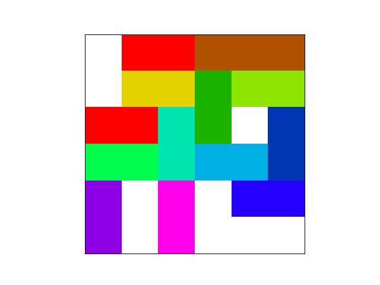

# Rush-hour
This project contains a total of eight algorithms and heuristics to solve Rushhour puzzles. Rushhour is a game where there are cars on a grid with a few very simple rules:
1. A car cannot drive through another car.
2. A car cannot drive out of the grid. Except for the red car.
3. The game is won when the red car can drive out of the right side of the grid

These simple rules create a rather complex game. The game is easy enough to solve, trying random moves will eventually lead to a solution. But the goal of this project is to solve these problems in as few steps as possible, this is much more difficult. Because finding an optimal solution with certainty requires memorizing all other possible ways to go through the grid. This quickly becomes unmanageable, even for a computer with several gigabytes of RAM.

This README first explains what the algorithms and heuristics do, then it will explain how to use them. Or you can just run "python3 main.py" in the terminal and you can probably figure the usage out yourself. 

A visualization of a solution looks a bit like this:

# Constructive Algorithms
Here the algorithms that construct a solution from scratch are explained.

## Breadth-First
The Breadth-First algorithm tries every single movement options of the car one by one, and does the same for the new configurations. This tries every option for every step and will always find the best solution. But the memory needed for this algorithm grows exponentially, that's why it's not viable for more complex puzzles.

## Beam-Search
Beam-Search works similar to Breadth-first, but instead of trying every option it only moves every car as far as possible. If there are two possible movements with the same distance it picks one randomly. This will often find the best solution, but will also sometimes be one or two moves off and is inconsistent because of the random choice. The memory of this method also grows exponentially, but not quite as fast as Breadth-first. Although no puzzle has been found that this algorithm can solve that Breadth-First can't.

## Depth-first
This algorithm also tries every possible option, but uses less memory than Breadth-First. It does so by only trying one sequence of moves first until it finds a solution, then it walks back and tries every option along the way. It never has to search further than the best solution so far. The traditional depth-first uses a stack, but because in this problem it is smart to save every visited configuration anyway the stack is not necessary. This makes it more memory efficient, although the same movements of the cars have to be calculated several times. For every found configuration only the total movement of the cars and the amount of steps it took to get there have to be saved. Because all the algorithm needs is to know when it's worth pursuing a branch and when it's not, when no new or better configuration has to be found it does not have to pursue that branch.

## Random
This will move a random car randomly until a solution is found. But there are different methods to this, there are options to instead pick every car one by one. This will give more consistent results, but will not necessarily give better results. There is also the option to let cars only move the maximum amount forward or backwards, this will also give more consistent results. But the results also seem to be better. This will always solve a puzzle eventually, but the solution is often pretty bad.

## Improving-Random
This uses the random algorithm, but lets it run continually and saves the best solution thus far. It also stops early if the new attempt already exceeds the amount of steps of the best solution. This can lead to very good results, but it might take a long time.

# Iterative algorithms
Here the algorithms that improve solutions are explained.

## Take-Out-Loops
This takes out loops of a solution, a loop happens when the same cars move back and forth after one another. This is extremely fast, but it does not solve a lot of problems. It is useful to reduce the run time when optimizing a solution.

## Remove-Useless
This algorithm takes a movement of a car and adds the movement to the next time the car moves. This fuses two moves into one, this works very well for long solutions found by random algorithms. Although it gives no guarantee of an optimal solution, in combination with the improving-random heuristic it will often find good solutions.

## Breadth-first-Iterative
This algorithm uses the breadth first algorithm to try to optimize a solution. It does so by taking a random piece of the solution and tries to find a faster way to get to the last configuration of that piece. This is quite slow and does not work great, but it sometimes does find better solutions for a good solution.

## Depth-first
Depth-first can be used as constructive or iterative algorithm. For a basic explanation read Depth-first under constructive algorithm.

On top of the usage as explained under constructive algorithms it also has the option to give a solution to try to improve. This makes the search space much smaller and allows the algorithm to solve very complex puzzles optimally. It also uses the knowledge of the path to a solution, if a configuration that was in a solution has been reached faster the algorithm uses this to determine a new and faster solution.  It also has an option to only allow the furthest possible moves of cars to reduce the search space. Thus far this has always given the best possible solution, but it is no guarantee.

# Experiment
With the experiment methods, you can batch-run Improving-Random, Take-Out-Loops, and Remove-Useless in a very specific way and plot the results. It is not possible to adjust the parameters of this batch-run in the command line. It is also not possible to adjust where the results are saved. 
- Generate Solutions: For puzzles 1 through 7, generate 10 solutions with Improving Random set to 60 seconds. Each solution and a datafile with the amount of steps of every generated solution are written to csv files.
- Optimize: Optimize solutions that can be generated with the Generate Solutions method. Each solution is optimized with Take-Out-Loops, Remove-Useless, and a combination of both, each for 3 iterations. The optimized solutions with the combination of both iterative algorithms, as well as a datafile containing information about amount of steps and time, are exported to csv files.
- Plot_ImprovingRandom: Make a plot of the average amount of steps in the solutions generated by the Generate Solutions method.
- Plot_Iteration_Steps: Make a plot of the average amount of steps in the solutions after optimizing with the Optimize method.
- Plot_Iteration_Time: Make a plot of the average amount of time the different optimizations took in the Optimizing method.

# Usage
To use the algorithms main.py has to be ran. This can be done by typing "python3 main.py" in the terminal. Then a menu pops up and all the names of the algorithms can be seen including the abbreviations, the menu asks you to type the name or abbreviation of an algorithm. When you do that you can choose the puzzle you want to use the algorithm on. Either type the filename or type the puzzle number 1 to 7 or 10. Puzzle 10 is a very simple puzzle used for testing. If necessary the menu asks you to specify a method that slightly changes the algorithm. The possible methods and abbreviations are printed as well, so you don't have to look up anything. If the method uses a previous solution it asks you to name the file where that solution is saved. When the algorithm has ran it asks you if you want to save the solution and if you do it asks you what name you want to give it. If you saved a solution it also asks you if you want a gif of the solution. If you do it saves it under the same name as your solution.

If you want to quit type "quit" or 'q' when it is asking for the algorithm or puzzle file.
